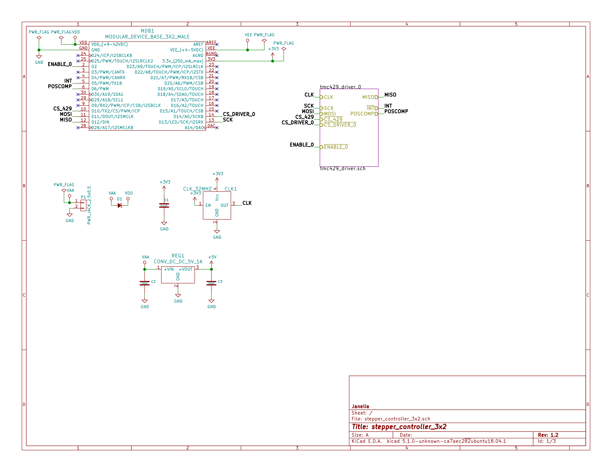
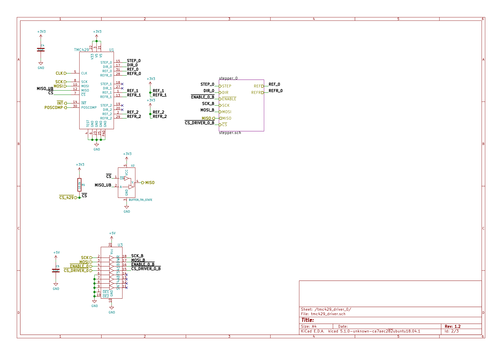
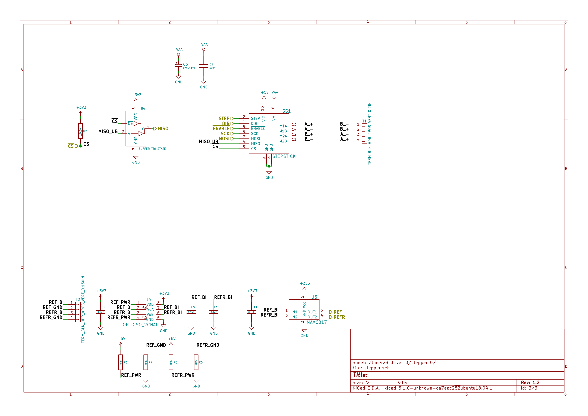
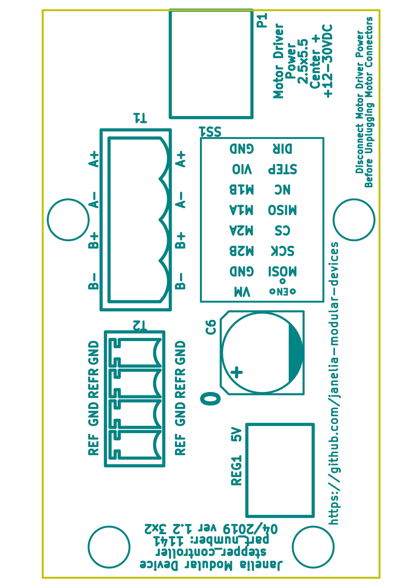
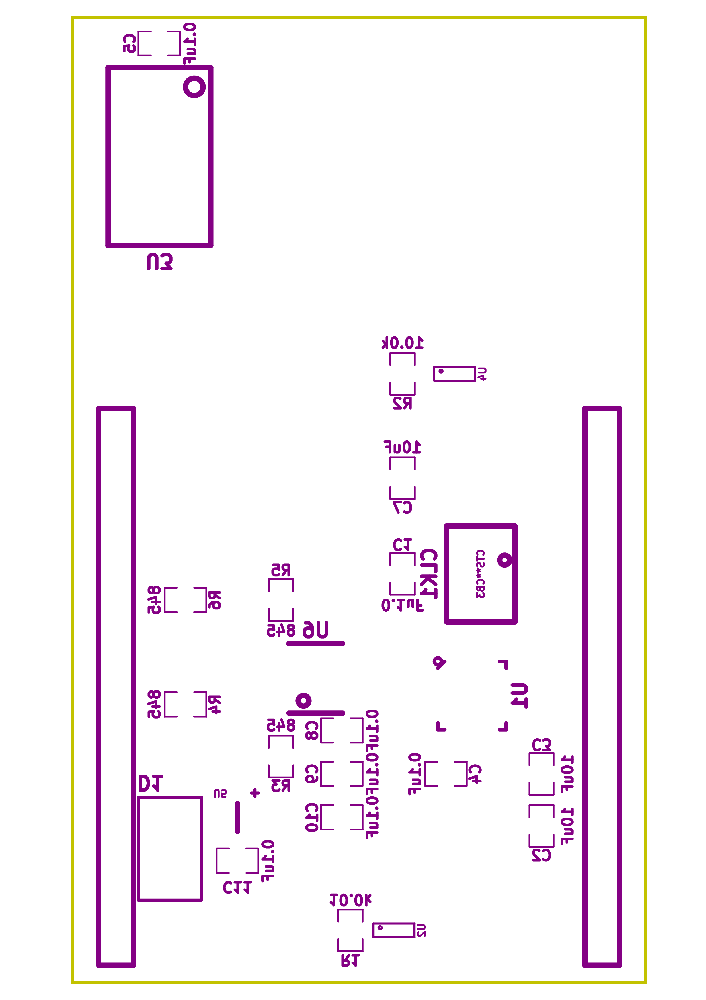

- [Repository Information](#orgc9c7126)
  - [Description](#org623a5bf)
- [Images](#org1e7d118)
- [Schematic](#org1bed005)
- [Gerbers](#orga20a872)
- [Bill of Materials](#orgaaed6d6)
  - [PCB Parts](#org5e94890)
  - [Supplemental Parts](#org4c9b4c5)
  - [Vendor Parts Lists](#orge23b973)
- [Supplemental Documentation](#org541ab7a)
  - [Assembly Instructions](#org2701e28)

# Repository Information

-   **Name:** stepper\_controller\_3x2
-   **Version:** 1.2
-   **License:** Open-Source Hardware
-   **URL:** <https://github.com/janelia-kicad/stepper_controller_3x2>
-   **Author:** Peter Polidoro
-   **Email:** peterpolidoro@gmail.com

## Description

This board controls 1 stepper motor with optional forward and reverse limit switches.

# Images

# Schematic

[./schematic/stepper\_controller\_3x2.pdf](./schematic/stepper_controller_3x2.pdf)

# Gerbers

Send gerbers zip file to your favorite PCB manufacturer for fabrication.

[./gerbers/stepper\_controller\_3x2\_v1.2.zip](./gerbers/stepper_controller_3x2_v1.2.zip)

# Bill of Materials

## PCB Parts

| Item | Reference(s)           | Quantity | PartNumber        | Vendor  | Description                                                               |
|---- |---------------------- |-------- |----------------- |------- |------------------------------------------------------------------------- |
| 1    | C1 C10 C11 C4 C5 C8 C9 | 7        | 399-14636-1-ND    | digikey | CAP CER 0.1UF 50V X7R 0805                                                |
| 2    | C2 C3 C7               | 3        | 445-14419-1-ND    | digikey | CAP CER 10UF 35V X5R 0805                                                 |
| 3    | C6                     | 1        | PCE3812CT-ND      | digikey | CAP ALUM 220UF 20% 50V SMD                                                |
| 4    | CLK1                   | 1        | CTX277LVCT-ND     | digikey | OSC XO 32.000MHZ HCMOS TTL SMD                                            |
| 5    | D1                     | 1        | 568-11697-1-ND    | digikey | DIODE SCHOTTKY 45V 10A CFP15                                              |
| 6    | MDB1                   | 2        | S1011E-16-ND      | digikey | 16 Position Header Through Hole Male Pins                                 |
| 7    | P1                     | 1        | CP-063BH-ND       | digikey | CONN PWR JACK DC 2.5X5.5 8A T/H                                           |
| 8    | R1 R2                  | 2        | P10.0KCCT-ND      | digikey | RES SMD 10K OHM 1% 1/8W 0805                                              |
| 9    | R3 R4 R5 R6            | 4        | P845CCT-ND        | digikey | RES SMD 845 OHM 1% 1/8W 0805                                              |
| 10   | REG1                   | 1        | 945-1395-5-ND     | digikey | CONV DC/DC 1A 5V OUT SIP VERT                                             |
| 11   | SS1                    | 16       | ED90331-ND        | digikey | CONN PIN RCPT .025-.037 SOLDER                                            |
| 12   | T1                     | 1        | 277-1152-ND       | digikey | TERM BLOCK HDR 4POS VERT 5.08MM                                           |
| 13   | T2                     | 1        | 277-1223-ND       | digikey | TERM BLOCK HDR 4POS VERT 3.81MM                                           |
| 14   | U1                     | 1        | 1460-1071-1-ND    | digikey | IC MOTOR CONTROLLER SPI 32QFN                                             |
| 15   | U2 U4                  | 2        | 296-11603-1-ND    | digikey | IC BUF NON-INVERT 5.5V SOT23-5                                            |
| 16   | U3                     | 1        | 296-14668-1-ND    | digikey | Buffer Non-Inverting 1 Element 8 Bit per Element Push-Pull Output 20-SOIC |
| 17   | U5                     | 1        | MAX6817EUT+TCT-ND | digikey | IC DEBOUNCER SWITCH DUAL SOT23-6                                          |
| 18   | U6                     | 1        | 516-2614-1-ND     | digikey | OPTOISO 3.75KV 2CH PUSH PULL 8SO                                          |

## Supplemental Parts

| Item | Quantity | PartNumber       | Vendor  | Description                       |
|---- |-------- |---------------- |------- |--------------------------------- |
| 1    | 1        | 277-1013-ND      | digikey | TERM BLOCK PLUG 4POS STR 5.08MM   |
| 2    | 1        | 277-1042-ND      | digikey | TERM BLOCK PLUG 4POS 5.08MM       |
| 3    | 1        | 277-1163-ND      | digikey | TERM BLOCK PLUG 4POS STR 3.81MM   |
| 4    | 1        | 277-1193-ND      | digikey | TERM BLOCK PLUG 4POS 90DEG 3.81MM |
| 5    | 1        | 1460-1187-ND     | digikey | TMC2130 STEPPER DRIVER BOARD      |
| 6    | 1        | 501100B00000G-ND | digikey | HEATSINK 14-DIP/16-DIP            |
| 7    | 1        | 3M10315-ND       | digikey | TAPE ADHESIVE TRANSFER 1/2in X5YD |

## Vendor Parts Lists

[./bom/digikey\_parts.csv](./bom/digikey_parts.csv)

[./bom/supplemental\_digikey\_parts.csv](./bom/supplemental_digikey_parts.csv)

# Supplemental Documentation

## Assembly Instructions

-   Solder header pins into the stepper driver board, making note of TOP label. Insert header pins on bottom of board so that the long unsoldered header pins point down when the TOP label faces up.
-   Expose one side of the thermal adhesive tape and attach to the bottom of the heatsink. Trim tape so it does not extend beyond heatsink edges.
-   Expose the other side of the thermal adhesive tape and attach the heatsink to the stepper driver board on the side with the TOP label.
-   Solder surface mount and through hole components onto the pcb.
-   Insert stepper driver board into pin receptacles.
